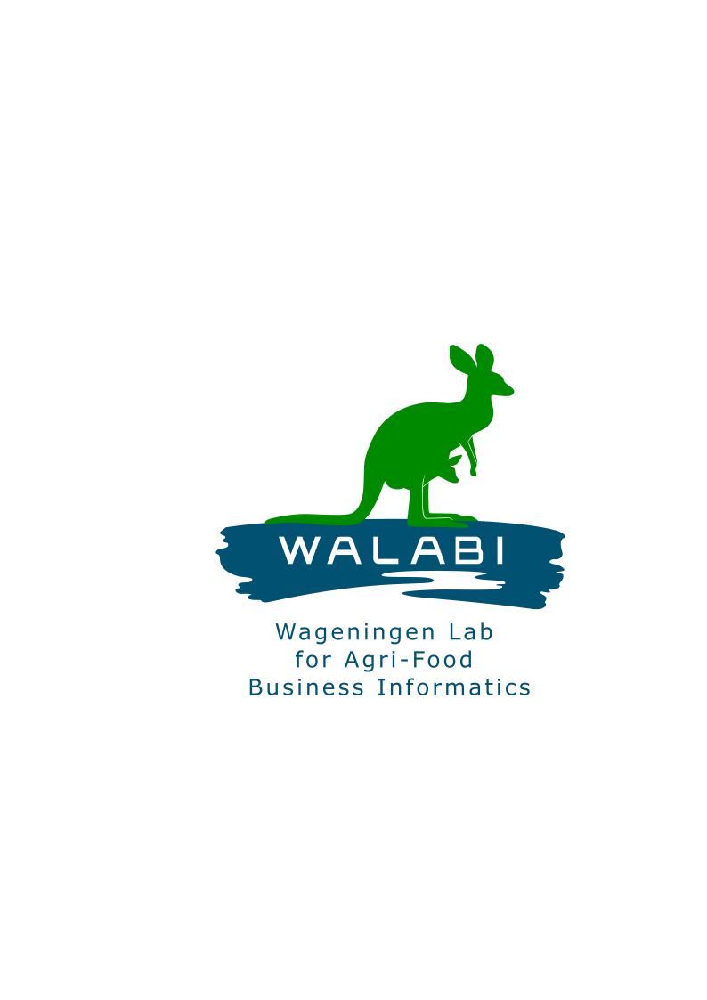

<p align="center">
  
</p>

<h2 align="center">WALABI Website</h2>

<p align="center">
  Wageningen Lab for Agri‑Food Business Informatics
  <br/>
  <a href="index.html"><strong>English Home</strong></a> ·
  <a href="index-nl.html"><strong>Nederlandse Home</strong></a> ·
  <a href="academy.html"><strong>Academy</strong></a>
</p>

<p align="center">
  <a href="#getting-started"></a>
  <a href="#features"></a>
  <a href="#responsive-design"></a>
</p>

---

## Table of Contents

- [Overview](#overview)
- [Features](#features)
- [Project Structure](#project-structure)
- [Getting Started](#getting-started)
- [Deployment (GitHub Pages)](#deployment-github-pages)
- [Customization](#customization)
- [Language Switching](#language-switching)
- [Responsive Design](#responsive-design)
- [Browser Compatibility](#browser-compatibility)
- [Contributing](#contributing)
- [License](#license)
- [Contact](#contact)

## Overview

This repository contains the static website for WALABI — Wageningen Lab for Agri‑Food Business Informatics.

## Features

- Clean, responsive layout with reusable `header.html` and `footer.html`
- English and Dutch landing pages (`index.html`, `index-nl.html`)
- Dedicated Academy page (`academy.html`)
- Vanilla HTML/CSS/JS stack, easy to host on GitHub Pages
- Simple scripts for language preference persistence

## Project Structure

```
/
├── index.html          # Main English page
├── index-nl.html       # Dutch version of the main page
├── academy.html        # Academy page
├── header.html         # Header component
├── footer.html         # Footer component
├── styles.css          # Stylesheet
├── script.js           # JavaScript functionality
├── images/             # Image directory
│   ├── Walabi-logo_large.png
│   └── Walabi-logo_white.png
├── CNAME               # Custom domain configuration (if used)
└── readme.md           # This file
```

## Getting Started

Run a local server to preview includes (`header.html`, `footer.html`) correctly:

### Option A: VS Code Live Server
1. Open this folder in VS Code
2. Install the "Live Server" extension
3. Right‑click `index.html` → "Open with Live Server"

### Option B: Node
```
npx serve
```
Then open the printed localhost URL.

### Option C: Python
```
python3 -m http.server 8080
```
Then visit `http://localhost:8080`.

## Deployment (GitHub Pages)

1. Push your changes to the default branch (e.g., `main`)
2. In GitHub → Settings → Pages, set Source to your default branch
3. If using a custom domain, add it in Pages and keep the `CNAME` file

Your site will be published shortly after saving.

## Customization

- **Colors**: Adjust CSS variables in `styles.css` under `:root`
- **Content**: Replace placeholder copy with WALABI themes, projects, and track record
- **Pages**: Duplicate `index.html` to add new sections/pages as needed

## Language Switching

Language preference is stored in the browser (local storage), enabling seamless switching between English and Dutch versions.

## Responsive Design

Optimized for mobile, tablet, and desktop. The navigation adapts automatically on smaller screens.

## Browser Compatibility

Tested on modern browsers:
- Chrome
- Firefox
- Safari
- Edge

## Contributing

Issues and pull requests are welcome. For larger changes, please open an issue first to discuss what you would like to change.

## License

Unless stated otherwise in this repository, content is provided under standard copyright. If you intend to add a license, place it in `LICENSE` and update this section.

## Contact

For questions or collaboration:
- Open an issue in this repository
- Or reach out via the lab’s standard communication channels
